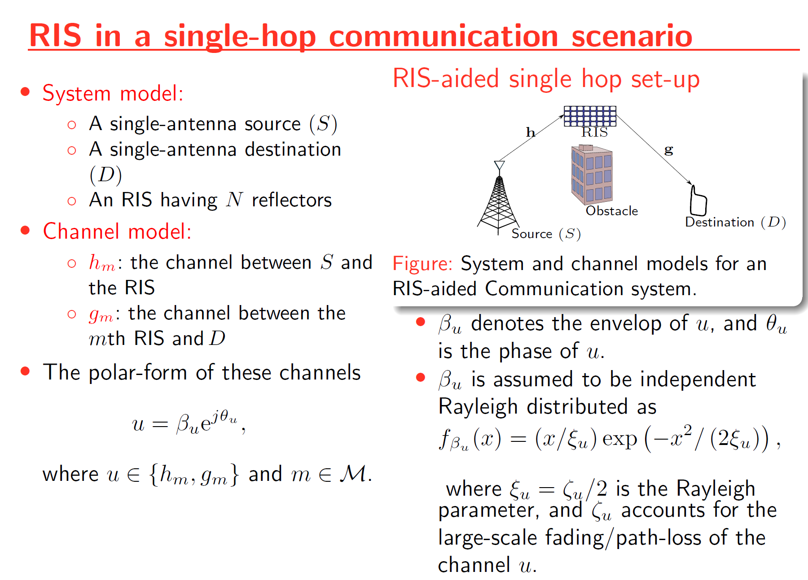

# On the Performance of IRS-Assisted Relay Systems

This paper investigates the performance of intelligence reflective surface (IRS)-assisted relay systems. To this end, we quantify the optimal signal-to-noise ratio (SNR) attained by smartly controlling the phase-shifts of impinging electromagnetic waves upon an IRS. Thereby, a tightly approximated cumulative distribution function is derived to probabilistically characterize this optimal SNR. Then, we derive tight approximations/bounds for the achievable rate, outage probability, and average symbol error rate. Monte-Carlo simulations are used to validate our performance analysis. We present numerical results to reveal that the IRS-assisted relay system can boost the performance of end-to-end wireless transmissions.

_Please see my presentation report **IRS_relay_globecom.pdf** for more information_ (Click here to open: [Link Alan_Devkota_presentation.pdf click here](./V1/IRS_relay_globecom.pdf))

_You can also see the presentation video here_ (Video : [Link presentation_video click here](./Presentation.mp4))

_Please see my **GLOBECOMM 2021** Conference video here_ (Link: [Link Thesis_Report click here](https://search.proquest.com/openview/51b8734f2a802215f1a126e336c397f8/1?pq-origsite=gscholar&cbl=18750&diss=y))

# System and channel model

# Outage Probability

# Simulation: Average achievable rate

# Simulation: Average BER

# Simulation: Phase-shift quantization

